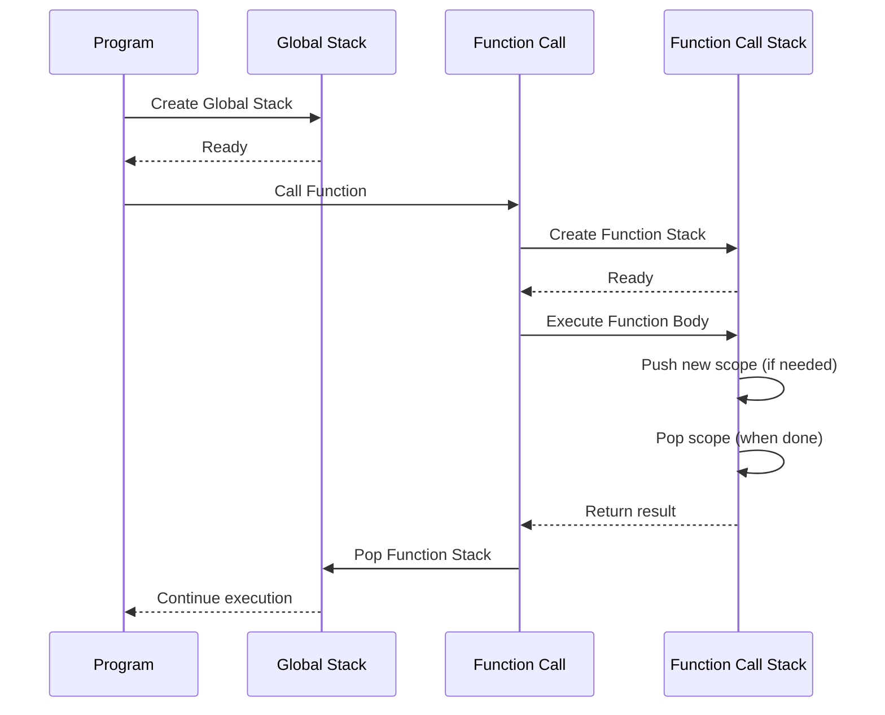

# Interpreter

The interpreter executes the validated AST by traversing it in a pre-order manner. It evaluates expressions, calls functions, and manages the execution context using the call stack.

## Execution Flow

The interpreter starts at the root of the AST and evaluates each node according to its type (e.g., expressions, function calls). The call stack is used to manage the scope and keep track of function calls and returns.

